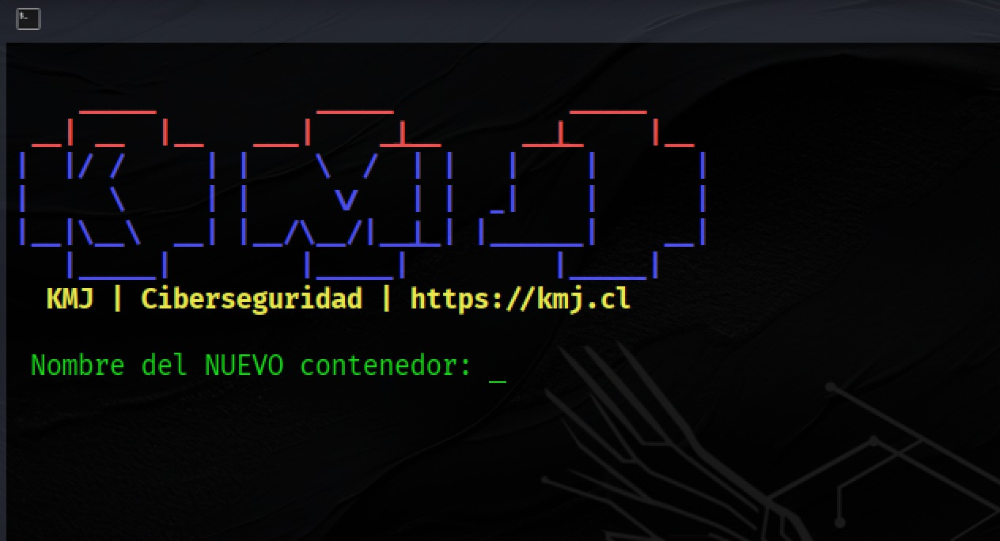
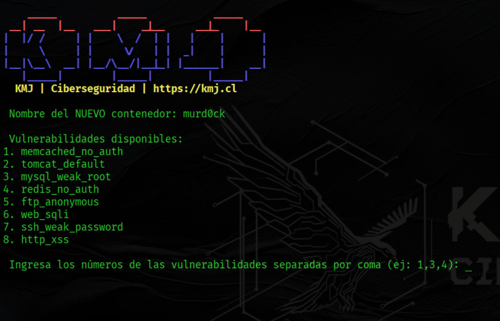
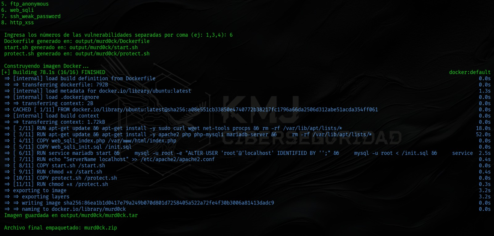
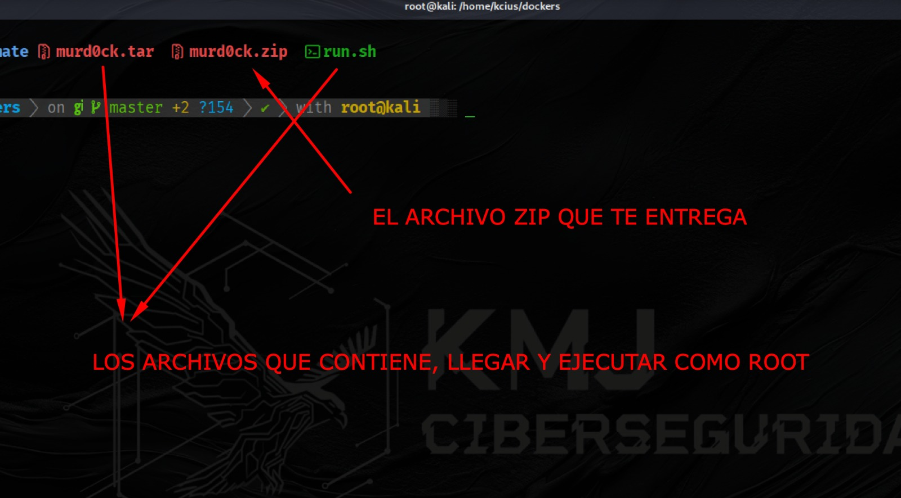

## Logo


# kciusbuilder
Herramienta hecha en python para generacion de contenedores Docker con vulnerabilidades de manera automatica.

### Instalacion
Instalacion rapida para Kali Linux
```
git clone https://github.com/hackingetico21/kciusbuilder 
cd kciusbuilder
sudo python3 kciusbuilder.py
```
OJO que se recomienda tener instalado DOCKER en su maquina Kali previamente.

  
*Paso 2: en la imágen de portada se ve la herramienta desplegada una vez se ejecuta "sudo python3 kciusbuilder.py", Luego llegamos a este paso donde debes ingresar el nombre del nuevo contenedor que crearás y eliges las vulnerabilidades que le agregarás al mismo.*  

  
*Paso 3: Una vez elegidas las vulnerabilidades (se separan por una coma), comenzará el proceso de creación y empaquetado del contenedor, una vez terminado quedara dentro de la carpeta "output" que se crea automaticamente y en la carpeta raiz del repositorio como un archivo .zip.*  

  
*Paso Final: El archivo .zip contiene el archivo "run.sh" y el archivo .tar con el nombre del contenedor que creaste, para ejecutar el contenedor se hace con la sintaxis "sudo run.sh archivo.tar"*  

Y eso es todo, la herramienta queda a su libre disposición, pueden modificar las vulnerabilidades, agregar mas funciones y hacerla mucho más interesante de lo que ya es.
A cuidarse y mucho exito, su amigo Kcius.
